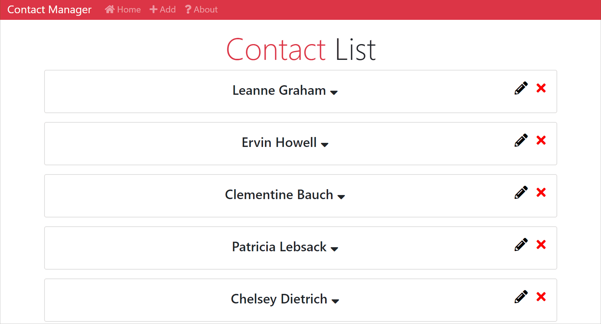
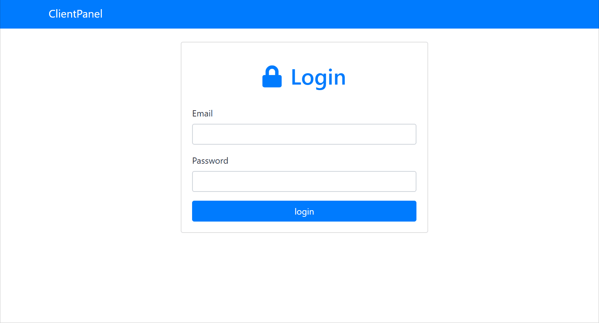
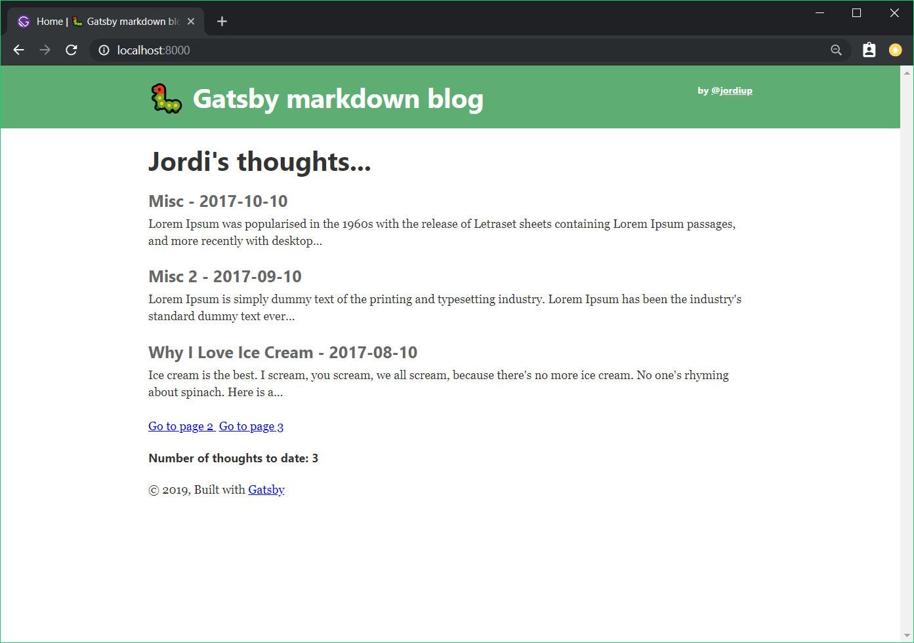
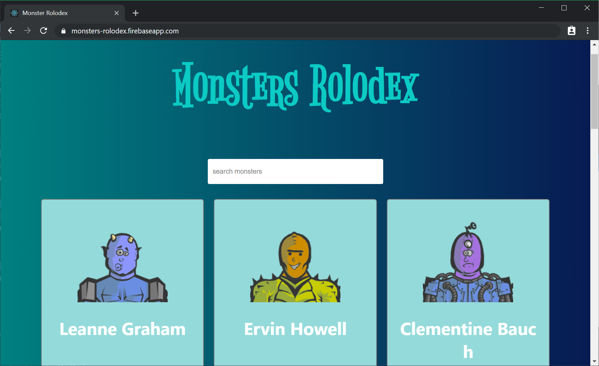
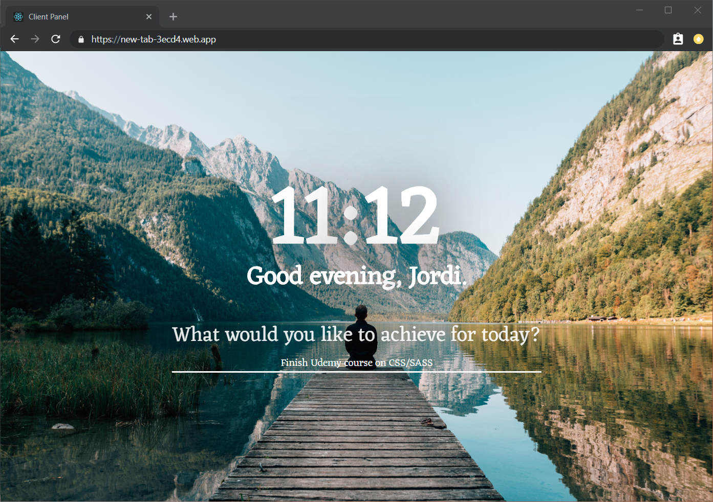

# React ⚛⚡ 
The purpose of this repo is to document my progress of React. So far I have taken two Udemy courses:
 - **'React Front To Back'**, one of the highest rated Udemy course about the React JS framework, instructed by Traversy Media.
  
  Topics covered:
  - Master React Concepts - Components, State, Props, etc
  - Learn & Use The Context API
  - Learn Redux From Scratch
  - Build & Deploy a Client Management App With React, Redux & Firebase/Firestore
  - Master ES6+ Features Like Arrow Functions, Spread & Async Await

 - **'Complete React Developer in 2019'**, a modernised course tackling large scale React development. (👷‍♂️🏗 WIP 🚧)

 ## Showcased projects
  The following project have been build in correspondence with the tutorials, and are deployed live with Firebase. Feel free to check them out.

  ### [Contact Manager](https://react-contact-manager-39497.firebaseapp.com)
 
  - Uses React and Redux
  - React Router for multiple pages
  - CRUD Functionality
  - Deployed on Firebase

 ### [Client Panel web ](https://reactclientpanel-d5a9d.firebaseapp.com/)
 
  - User signup/login functionality
  - Settings component
  - Uses Firebase/Firestore for authentication, and full CRUD database management
  - Deployed on Firebase

## Additional React projects
 ### [Gatsby markdown blog](https://gatsby-markdown-blog.firebaseapp.com/)
  

 ### [Monster Rolodex](https://gatsby-markdown-blog.firebaseapp.com/)
  

 ### [New tab web app ](https://new-tab-3ecd4.web.app/)
  

 
<!-- ---  -->

<!-- ## Udemy certificate 
 -->

<!-- Click below to demo a Client Panel web app using Firebase:
https://reactclientpanel-d5a9d.firebaseapp.com/ -->
